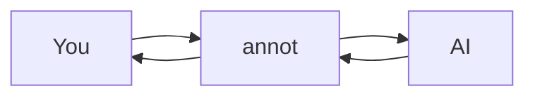

# Welcome to annot

> **annot**: ephemeral space for human-AI thinking

This is your playground. Annotate anything. Close anytime. Nothing here matters except what you learn.

---

## Your First Annotation

← Click the line number to the left. Or hover over this line and press **c**.

A text editor appears. Type anything. Press **Cmd+Enter** (or **Ctrl+Enter**) to seal it.

That's an annotation: feedback anchored to a specific location.

Try a few more lines:
- Click a sealed annotation to reopen it
- Hover + **c** is often faster than clicking the gutter
- **Shift+drag** over content to select a range

---

## Exit Modes

Look at the footer: `<Tab> set exit mode`

Press **Tab** now. Watch the footer change color.

Exit modes declare **session-level intent** — what should happen when you close:
- "Apply these changes"
- "Reject and explain why"
- "Need more discussion"

Create custom modes via Command Palette (**:**) → "Exit Modes".

---

## Session Comment

Press **Shift+C** now.

The session comment is **global context** that frames all your annotations:
- "Focus on error handling, ignore style"
- "Architecture looks good, details below"

Exit mode + session comment = the broad strokes. Annotations = the fine details.

---

## Tags: Your Prompt Library

Tags are composable mini-prompts you build over time.

Hover over this code and press **c**, then type `#` in the editor:

```rust
fn process_data(input: &str) -> Result<Data, Error> {
    let parsed = serde_json::from_str(input)?;
    validate(&parsed)?;
    Ok(transform(parsed))
}
```

Tags mix inline with prose: "This function [# SECURITY] has potential injection issues and [# QUESTION] why not validate first?"

**Two ways to create tags:**
1. Command Palette (**:**) → "Tags" → create from scratch
2. Select text in an annotation → press Enter when "Create Tag" appears → instant tag from selection

Over time, you'll accumulate a personal library that travels with you.

---

## Highlights

AI can use ==highlights== to draw your attention to important parts.

This sentence has a ==highlighted phrase== in it. Highlights help you scan documents faster when reviewing AI-generated content.

---

## Slash Commands

Inside any annotation, type `/`:

### /excalidraw

Draw a diagram. Create an annotation, type `/excalidraw`, press Enter.

Sketches communicate what words can't — component relationships, data flows, "the bug is here."

### /replace

Propose code changes inline. Don't say "fix the bug" — show the fix:

```python
def calculate_total(items):
    total = 0
    for item in items:
        total -= item.price  # Bug: should be +=
    return total
```

Select lines, create annotation, type `/replace`, write the corrected version.

---

## Code Blocks

Annotate any line inside code:

```typescript
interface User {
  id: string;
  email: string;
  preferences: {
    theme: 'light' | 'dark';
    notifications: boolean;
  };
}

async function fetchUser(id: string): Promise<User> {
  const response = await fetch(`/api/users/${id}`);
  if (!response.ok) throw new Error('User not found');
  return response.json();
}
```

---

## Tables

Annotate rows. Use `/replace` to suggest changes:

| Shortcut | Action |
|----------|--------|
| c | Annotate hovered line |
| Shift+drag | Select range |
| Cmd+Enter | Seal annotation |
| Tab | Cycle exit mode |
| Shift+C | Session comment |
| : | Command Palette |

---

## Mermaid Diagrams

annot renders Mermaid diagrams inline. Click the icon on the right to view full-size:



The loop: human and AI taking turns until something crystallizes.

---

## Portals

Portals embed live code from other files:

[Sample code](./demo.rs#L1-L15)

Not a screenshot — actual file content rendered inline. In real use, AI references your codebase directly.

You can annotate lines inside portals too.

---

## Image Paste

When invoked by an AI agent (MCP mode), you can **paste images** into annotations:
- Screenshots of bugs
- Diagrams from other tools
- Reference designs

In CLI mode, image paste is disabled (text-only output).

---

## Keyboard Reference

| Key | Action |
|-----|--------|
| **c** | Annotate hovered line |
| **Click gutter** | Select line |
| **Shift+drag** | Select range |
| **Cmd+Enter** | Seal annotation |
| **Escape** | Cancel / close modal |
| **Tab / Shift+Tab** | Cycle exit modes |
| **Shift+C** | Session comment |
| **:** | Command Palette |
| **Cmd+S** | Save to file |
| **Cmd+/-/0** | Zoom |

## Color Palette

Design tokens with inline color previews:

```css
:root {
  /* Primary colors */
  --primary: #3b82f6;
  --primary-dark: #1d4ed8;
  --primary-light: #93c5fd;

  /* Semantic colors */
  --success: #22c55e;
  --warning: #f59e0b;
  --error: #ef4444;

  /* Neutrals */
  --gray-50: #f9fafb;
  --gray-900: #111827;

  /* With alpha */
  --overlay: #00000080;
  --highlight: #fbbf2440;
}
```

Colors in different contexts:
- Brand color: `#6366f1` (Indigo 500)
- Short hex: `#fff` and `#000`
- With alpha: `#ff000080` (50% red)

---

## YAML Example

Configuration with various YAML patterns:

```yaml
name: annot
version: "1.0.0"

features:
  - annotations
  - exit-modes
  - tags
  - portals

config:
  theme: dark
  auto-save: true
  keybindings:
    annotate: "c"
    seal: "Cmd+Enter"
    palette: ":"

nested:
  list:
    - item-one
    - item-two
    - nested-item:
        key: value
        another-key: "string-value"

multiline: |
  This is a multiline
  string with dashes - like this
  and more - content here
```

---

## Closing

The core of annot:
- **Exit modes** — session intent ("Apply", "Reject")
- **Session comment** — global context
- **Annotations** — line-level feedback with **tags**
- **Slash commands** — `/excalidraw`, `/replace`

Close whenever. **Cmd+W**.

The session is ephemeral. The artifact persists.

Think together. Until something crystallizes. Then move on.
